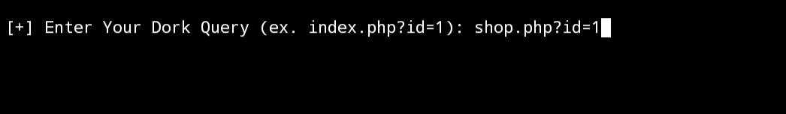
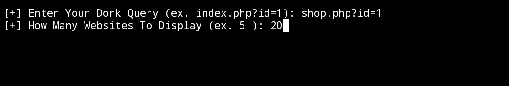
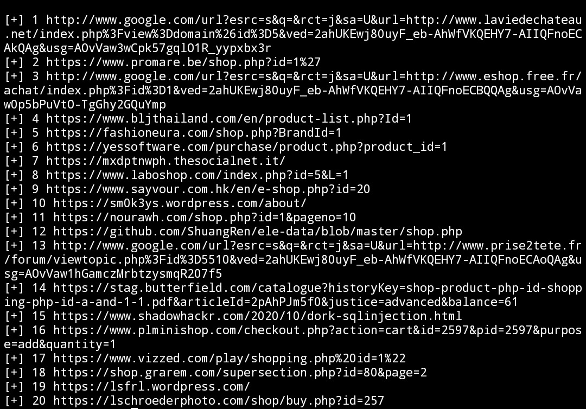

# GooDorks
Good Dorking tool that searchs and gives the best results


---
GooDorks is a command-line tool that allows you to search for websites using Google dorks. This tool is written in Node.js and requires the following dependencies to be installed:

* [Node.js](https://nodejs.org/en/)

* [npm](https://www.npmjs.com/)

* [google-it](https://www.npmjs.com/package/google-it)

* [readline](https://nodejs.org/api/readline.html)

* [fs](https://nodejs.org/api/fs.html)

## Installation

To install GooDorks, follow these steps:

1. Ensure that you have Node.js and npm installed on your machine.

2. Install the `google-it`, `readline`, and `fs` packages by running the following command:

   ````

   npm install google-it readline fs

   ```

3. Clone the repository using the following command:

   ````

   git clone <repository url>

   ```

4. Navigate to the `GooDorks` directory using the following command:

   ````

   cd GooDorks

   ```

5. Launch the tool by running the following command:

   ````

   node goodork.js

   ```

## Usage

To use GooDorks, follow these steps:

1. Enter a dork query when prompted.

   

2. Enter the number of websites to display when prompted.

   


3. View the list of websites that match your query.

   

## Disclaimer

Please note that I am not responsible for any misuse or unethical or illegal use of this tool. Use at your own risk.

---
